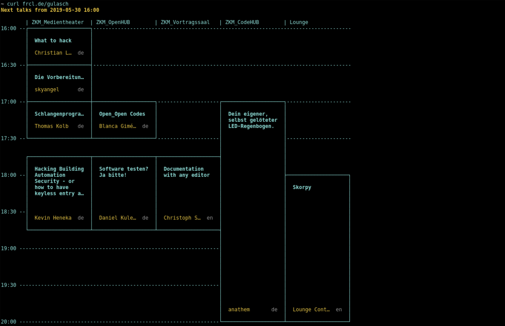

# gulasch

View the Fahrplan for #gpn19 from your terminal. Type

	$ curl frcl.de/gulasch

and get

## Usage

By default `frcl.de/gulasch` returns a nicely formatted timetable of events starting in the next two ours.
You can control the dispalyed data with parameters.

If the timetable is to large for your needs you can change the column width

	$ curl frcl.de/gulasch\?colwidth=15

or get a more compact list with

	$ curl frcl.de/gulasch\?format=list

(Notice that the `?` needs to be escaped for most shells, alternativly use a quoted string as URL.)
If you want to reuse the data, `format=json` gets you a machine readable version.

You can extend the time period for dispalyed events with the `within` parameters.

	$ curl frcl.de/gulasch\?within=4h

It accepts hours with `h` or minutes with `min`.

The `from` parameter lets you see the events from the future.
For example all events on day 2 starting at noon:

	$ curl frcl.de/gulasch\?from=2019-05-31T12:00\&within=12h

## Server installation and usage

If you want to run the server on your own machine, clone the git repository and run

	pipenv run python gulaschkanone.py -p 8080

You can then find the Fahrplan under `localhost:8080/gulasch`.
